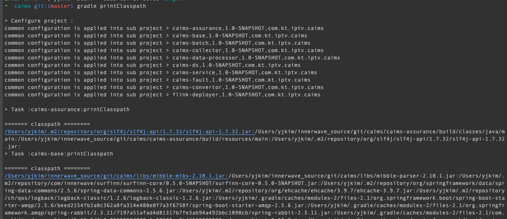

## 1) gen-class-doc
> javadoc 주석으로 클래스 정의서를 자동생성하는 프로젝트입니다.
- java 8
- gradle v7.5.1
- spring boot v2.7.1

<br>

## 2) 설정 
> `GenConstant.java`에서 설정합니다.

<table>
  <thead>
      <th>필드 명</th>
      <th>설명</th>
      <th>비고</th>
  </thead>
  <tbody>   
      <tr>
          <td>PJ_ROOT_PATH</td>
          <td>프로젝트 최상위 디렉토리 경로</td>
          <td>절대 경로</td>
      </tr>
      <tr>
          <td>PJ_MODULES</td>
          <td>프로젝트 모듈 List</td>
          <td>디렉토리는 '/'으로 구분</td>
      </tr>
      <tr>
          <td>PJ_CLASSPATH_FILE_PATH</td>
          <td>build시 필요한 classpath 정보가 담긴 파일 경로</td>
          <td>gen-class-doc 상대 경로<br> 기본값 :  project/classpath.txt </td>
      </tr>
      <tr>
          <td>PJ_SOURCE_PATH</td>
          <td>java 소스파일 경로</td>
          <td>${PJ_ROOT_PATH}/${PJ_MODULES}/src/main/java</td>
      </tr>
      <tr>
          <td>DOCLET_OUTPUT_PATH</td>
          <td>클래스 정의서 저장 경로</td>
          <td>gen-class-doc 상대 경로</td>
      </tr>
      <tr>
          <td>DOCLET_OUTPUT_WORD</td>
          <td>클래스 정의서 파일명 형식</td>
          <td>${PJ_MODULES}_${현재시각}.docx <br> 변경불가</td>
      </tr>
      <tr>
          <td>DOCLET_LOG_FILE</td>
          <td>javadoc 로그 파일명</td>
          <td></td>
      </tr>   
      <tr>
          <td>REPLACE_LIST</td>
          <td>제거할 문구  리스트</td>
          <td></td>
      </tr>       
      <tr>
          <td>MAKE_ONE_FILE</td>
          <td>true : 파일 한개로 생성<br>false : ${PJ_MODULES}별로 파일이 생성</td>
          <td></td>
      </tr>  
      <tr>
          <td>CAL_FILLED</td>
          <td>true : ${CAL_FILLED_THRESHOLD} 이상 설명이 달린 클래스만 생성 <br>false : 무조건 전부 생성</td>
          <td></td>
      </tr>
      <tr>
          <td>CAL_FILLED_THRESHOLD</td>
          <td>설명이 적힌 비율 임계치 (임계치 이하인 클래스는 생성하지 않음)</td>
          <td>${CAL_FILLED}가 true일때 사용된다.</td>
      </tr>
  </tbody>
</table>


<br>

## 3) 실행 방법
### 1. `GenConstant.java`에서 클래스 정의서 생성시 필요한 정보를 설정 합니다.
> 2) 설정을 참고합니다.
### 2. classpath 파일 작성
> 대상 프로젝트 빌드시 필요한 classpath 정보를 파일로 작성합니다. (`PJ_CLASSPATH_FILE_PATH`에 설정된 파일에 작성)

- 대상 프로젝트에 'printClasspath' gradle task를 추가합니다.

    ```
    subprojects {
        
        ... 
        
        task printClasspath(){
            doLast {
                println "\n======= classpath ========"
                sourceSets.main.compileClasspath.files.each {
                    print it.path+":"
                }
                sourceSets.main.runtimeClasspath.files.each {
                    print it.path+":"
                }
            }
        }
        
        ...
    }
    ```

- `gradle printClasspath` 를 실행 합니다. <br><br>

- console에 찍힌 classpath를 `project/classpath.txt` 파일에 붙여넣기 합니다.
  - classpath 파일 경로 : `GenConstant.PJ_CLASSPATH_FILE_PATH`에서 변경 가능.

<br>


### 3. GenClassDocLauncher 실행
> Spring Boot Run 'GenClassDocApplication'

- 설명이 많이 달린 순으로 생성 됩니다.
- 실행 결과 콘솔 창.


